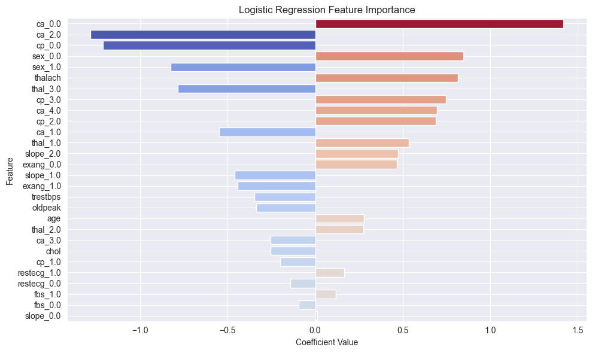

# Heart Disease Prediction Model

This project builds a binary classification model to predict the presence of heart disease based on clinical data. The dataset is derived from the Cleveland Heart Disease dataset (original source: UCI), with duplicates removed from a Kaggle version (linked here: https://www.kaggle.com/datasets/johnsmith88/heart-disease-dataset)

## Overview

The model uses features such as age, chest pain type, blood pressure, cholesterol, ECG results, and others to identify individuals at risk of heart disease. Logistic Regression is used as the classifier in a preprocessing pipeline that handles scaling, encoding, and missing value imputation.

## Contents

- **heart_disease_prediction.ipynb**: Jupyter notebook with data exploration, modeling, evaluation, and feature importance.
- **remove_duplicate.py***: the script used to clean duplicates from the original linked dataset
- **figures/**
  - **eda/**: Visualizations from exploratory data analysis.
  - **eval/**:  Visualizations from model evaluation.
- **prints/**: Text outputs.

## Notes

- The model performs with an average ROC-AUC around 0.91, but is limited by dataset size.
- This project is for educational purposes only and is not intended for clinical use.

## How to Use

1. Ensure you have the required Python packages installed: pandas, numpy, matplotlib, seaborn, scikit-learn, joblib
2. Run the notebook to perform EDA, train the model, evaluate performance, and visualize feature importance.

## Feature Importance of Moddel
